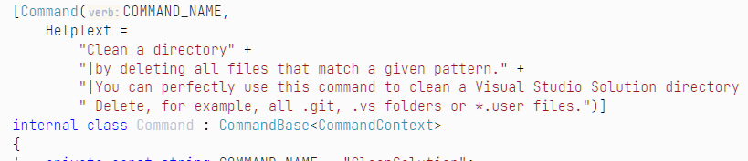
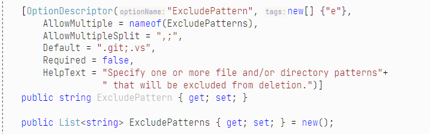
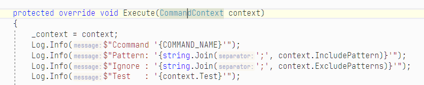
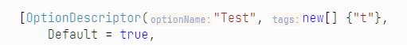

# CleanSolution
First of all, *CleanSolution* is a  [CLArgs - the Command-Line Parser](https://github.com/msc4266/CLArgs) demo application. `CLArgs` completely covers all command-line related topics so that you can focus on cleaning a directory, which is finally not more than ~30 line of code. 

Second of all, *CleanSolution* is a great too to clean your directories. 

> Personally, I use *CleanSolution* to remove all 'unnecessary' files and folders from my Visual Studio Solution folders before I zip or ship source-code from time to time. I also use it for *Dart /Flutter* application (with a different "Profile"), as well as in other situations. You can easily create and use your own cleansing profiles for different purposes. One profile is included: `sln.profile` - more see below.

## How to use it

After you have installed *CleanSolution* (see below) ...

* Open Command-Line and 
* navigate to any Visual Studio Solution directory on your drive.

###  Show All Commands

Run *CleanSolution* without any parameter will ask `CLArgs` to print all Command's help-text.

```batch
C:\vStudio\_gitHub\CleanSolution> CleanSolution

1 Commands available.

CleanSolution       Clean a directory
                    by deleting all files that match a given pattern.
                    You can perfectly use this command to clean a Visual Studio
                    Solution directory before you ship it. 
                    Delete, for example, all .git, .vs folders or *.user files.
```

If you look at the source-code, you will see, all you have to do, is to write the help-text. Not a single line of code to support such help functionality in your command-line app.



### Get help on specific Command

Run `CleanSolution /Help` to see a brief description of all command-line arguments.

Again: not a single line of code required to get this output.

```
C:\vStudio\_gitHub\CleanSolution> CleanSolution /Help
CleanSolution v21.4.7772.39701 Isx64=True Build=RELEASE, 12.04.2021 20:03:22

CleanSolution       Clean a directory
                    by deleting all files that match a given pattern.
                    You can perfectly use this command to clean a Visual Studio
                    Solution directory before you ship it. Delete, for example,
                    all .git, .vs folders or *.user files.
--------------------------------------------------------------------------------
/Pattern            Tags=p optional AllowMultiple=True Split=',;'
                    Specify one or more (; separated) patterns for files or
                    directories that will be deleted.
                    For example: *\obj or *.user
```

Check source-code  `CommandContext` to see how command-line option are defined.



`CLArgs` turns all command-line arguments into strongly typed properties and passes them as a `CommandContext`to your Command:



### Use an explicit list of Options

```
C:\vStudio\_gitHub\CleanSolution> CleanSolution.BAT "/p=*\obj;*\bin;*.pdb;*.user  /e=*\.git;*\.vs"
>>> The Batch file requires the arguments to be included in ""
```

> By default, *CleanSolution* runs in TEST mode, to not harm your system. It does not delete anything until you specify `t=false`.  
>
> See 'Test' Option definition, `Default=True`
> 

```
CleanSolution v21.4.7772.39701 Isx64=True Build=RELEASE, 12.04.2021 20:03:22
Ccommand 'CleanSolution'
Pattern: '*\obj;*\bin;*.pdb;*.user'
Ignore : '*\.git;*\.vs'
Test   : 'True'
Root   : C:\vStudio\_gitHub\CleanSolution

EXclude: \.git
EXclude: \.vs
DELete pub\CleanSolution.Command.pdb
EXclude: \src\.vs
RemoveDirectory: \src\CleanSolution\bin
RemoveDirectory: \src\CleanSolution\obj
```

### Use a pre-defined profile

`CLArgs` allows you to use config file (which simply contain a pre-defined set of parameters).

> Profiles, argument collections, config files - whatever you call them - are `CLArgs`built-in functionality. You can seamlessly use this functionality without a single line of code. The arguments contained in a config file are passed to your Command as if they were explicitly specified, like in the previous example.

There is one config file included in the `pub` folder:  `sln.profile` 

```
C:\vStudio\_gitHub\CleanSolution> CleanSolution @sln.profile
```

Content of *sln.profile*  - do you see the arguments?

```
#
# A CLArgs config file containing predefined Options
#
# This set of options represent a Visual Studio SLN cleansing profile.
# 

# Use the ability to specify /p (Patterns) as often as you want.

# Directiory deletions
/p="*\obj;*\bin"

# File deletions
/p="*.pdb;*.user;*.snk"  

# Files and Directories can also be specified in one single list.
# Using two times /p is only for better readbility of this file.

# Exclusion: ignore those directories
/e="*\.git;*\.vs;*\pub"
```

##  How to install CleanSolution

Download the `pub` folder and copy & paste it to any location on your local disc. Run `CleanSolution.exe`.

My personal way of using it: 

* Navigate to `%LocalAppData%` (and create a subfolder `Programs` if it does not exist)

  * Under this folder create another one: `CleanSolution`.
  * Copy the `pub` folder content to this folder

* Add `<YourUser>\AppData\Local` to your `PATH` 

* Create the Batch File there: `<YourUser>\AppData\Local\CleanSolution.bat`

  with the following content 

  ```batch
  @echo off
  set App=%LocalAppData%\Programs\CleanSolution
  call %App%\CleanSolution.exe %1 %2 %3 %4 %5 %6 %7 %8 %9
  ```
Now, you can use [CleanSolution.Bat]() from any folder you want.

Markus Schmidt (Pro), 2021-04-12